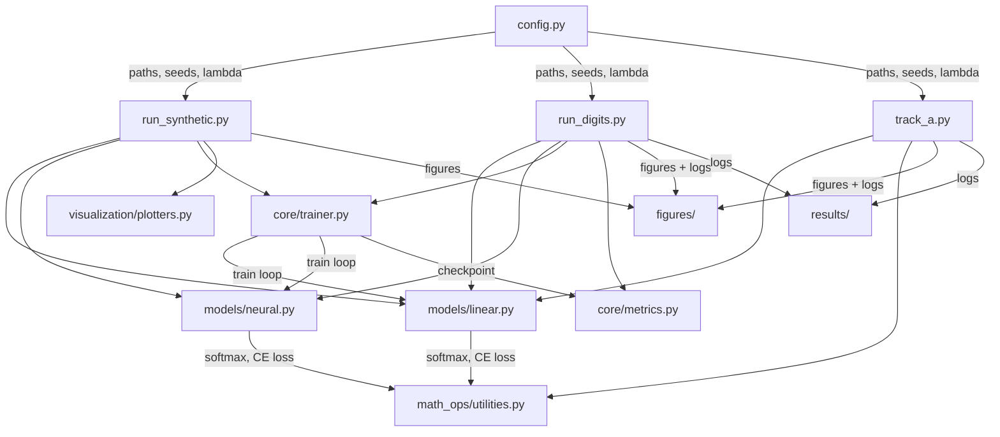

# Math4AI Capstone: Softmax Regression vs. Neural Network

A from-scratch NumPy implementation comparing multiclass Softmax Regression against a One-Hidden-Layer Neural Network with tanh activation, designed to answer a precise question: **when does adding a hidden layer genuinely help, and when is the extra complexity wasted?**

---


---

## Table of Contents

- [Overview](#overview)
- [Installation](#installation)
- [Usage](#usage)
- [Features](#features)
- [Project Structure](#project-structure)
- [Tech Stack](#tech-stack)
- [Architecture](#architecture)
- [Key Results](#key-results)
- [Team](#team)

---

## Overview

This project is the capstone deliverable for the Math4AI course. It investigates the boundary between linear and nonlinear classification through controlled experiments on three datasets with deliberately different geometric structures:

- **Linear Gaussian** -- two isotropic blobs where a hyperplane suffices.
- **Interlocking Moons** -- two crescents that wrap around each other, requiring a nonlinear boundary.
- **Digits Benchmark** -- 10-class handwritten digit classification (8x8 images, 64 dimensions).

Every model, training loop, gradient computation, and evaluation metric is implemented from scratch in NumPy. No PyTorch, TensorFlow, or scikit-learn classifiers are used.

---

## Installation

**Prerequisites:** Python 3.8 or higher.

```bash
# Clone the repository
git clone https://github.com/<your-username>/math4ai-capstone.git
cd math4ai-capstone

# Install dependencies
pip install numpy matplotlib scikit-learn
```

> `scikit-learn` is used only for loading the digits dataset and generating synthetic data. All models and training logic are pure NumPy.

---

## Usage

All experiment scripts are located in `src/` and should be run from the **repository root**.

### Run Synthetic Experiments (Gaussian + Moons)

```bash
python -m src.run_synthetic
```

Generates decision-boundary plots for both models on both synthetic datasets, plus the capacity ablation (hidden widths 2, 8, 32). Figures are saved to `figures/`.

### Run Digits Benchmark (Repeated-Seed Protocol)

```bash
python -m src.run_digits
```

Trains both models across 5 random seeds, reports test accuracy and cross-entropy with 95% confidence intervals, and runs the learning-rate ablation. Results are logged to `results/digits_log.txt`.

### Run Track A: PCA/SVD Analysis

```bash
python -m src.track_a
```

Performs PCA via SVD on the digit input space, generates the scree plot and 2D projection, and evaluates Softmax Regression at reduced dimensions (m = 10, 20, 40). Results are logged to `results/track_a_log.txt`.

### Run Unit Tests

```bash
python -m pytest tests/ -v
```

Executes 9 sanity checks covering numerical stability, gradient shapes, softmax normalization, and loss convergence.

---

## Features

- Full vectorized mini-batch gradient descent with numerically stable softmax (row-wise max subtraction)
- Complete backpropagation derivation and implementation for the one-hidden-layer network
- Numerically stable cross-entropy loss with L2 regularization
- Repeated-seed evaluation protocol with 95% confidence intervals (t-distribution, 4 d.f.)
- Capacity ablation across hidden widths {2, 8, 32}
- Learning-rate ablation across {0.005, 0.05, 0.2} with convergence dynamics analysis
- PCA/SVD dimensionality reduction and classification in reduced subspaces
- Automated figure generation and structured result logging
- Modular, clean-code architecture with Google-style docstrings throughout

---

## Project Structure

```
math4ai-capstone/
|
|-- src/                          # Source package
|   |-- config.py                 # Global paths, hyperparameters, logger setup
|   |-- run_synthetic.py          # Gaussian + Moons experiments
|   |-- run_digits.py             # Digits benchmark + ablations
|   |-- track_a.py                # PCA/SVD analysis (Track A)
|   |
|   |-- models/                   # Classifier implementations
|   |   |-- linear.py             # SoftmaxRegression (forward, backward, predict)
|   |   |-- neural.py             # OneHiddenLayerNN (forward, backward, predict)
|   |
|   |-- core/                     # Training and evaluation engine
|   |   |-- trainer.py            # Mini-batch training loop with early stopping
|   |   |-- metrics.py            # Accuracy and cross-entropy evaluation
|   |
|   |-- math_ops/                 # Mathematical primitives
|   |   |-- utilities.py          # Numerically stable softmax computation
|   |
|   |-- visualization/            # Plotting utilities
|       |-- plotters.py           # Decision boundary visualization
|
|-- tests/
|   |-- test_models.py            # 9 automated sanity checks
|
|-- figures/                      # Generated plots (decision boundaries, PCA, ablations)
|-- results/                      # Experiment logs (digits_log, track_a_log, test_log)
|-- report/                       # Final compiled report (PDF)
|-- slides/                       # Presentation materials
|-- data/                         # Data directory (auto-populated at runtime)
|
|-- .gitignore
|-- CHECKLIST.md                  # Rubric compliance checklist
|-- README.md
```

---

## Tech Stack

| Technology    | Purpose                                                  |
|---------------|----------------------------------------------------------|
| Python 3.8+   | Core language                                            |
| NumPy          | All linear algebra, model parameters, gradient computation |
| Matplotlib     | Decision boundary plots, scree plots, training dynamics  |
| scikit-learn   | Dataset loading only (digits, moons, blobs)              |
| LaTeX (ACM)    | Final academic report typesetting                        |

---

## Architecture



---

## Key Results

| Model                   | Test Accuracy          | Test Cross-Entropy       |
|-------------------------|------------------------|--------------------------|
| Softmax Regression      | 94.73% +/- 0.38%      | 0.2315 +/- 0.0017       |
| One-Hidden-Layer NN     | 95.22% +/- 0.38%      | 0.1765 +/- 0.0127       |

**Main findings:**

- On linearly separable data (Gaussian), both models perform identically -- the hidden layer adds nothing.
- On nonlinear data (Moons), the linear model fails structurally. The hidden layer is essential.
- On digits, accuracy is nearly tied, but the neural network reduces cross-entropy by 23.8%, indicating better probability calibration.
- PCA confirms that 40 principal components recover 94.57% accuracy, revealing a dominant low-rank linear structure in the digit input space.

The full analysis is available in [`report/Math4AI_Capstone_Report.pdf`](report/Math4AI_Capstone_Report.pdf).

---

## Team

| Name             | Role                                                  | Contact                           |
|------------------|-------------------------------------------------------|-----------------------------------|
| Avaz Asgarov     | PCA/SVD analysis, repository management, report       | evez.esgerov25@aiacademy.az       |
| Raul Aghayev     | Neural Network implementation, synthetic experiments   | raul.agayev25@aiacademy.az        |
| Emil Ahmadli     | Digits benchmark, repeated-seed evaluation, ablations  | emil.ahmedli25@aiacademy.az       |
| Kazim Mammadli   | Softmax Regression, training loop, evaluation utilities| kazim.memmedli25@aiacademy.az     |
